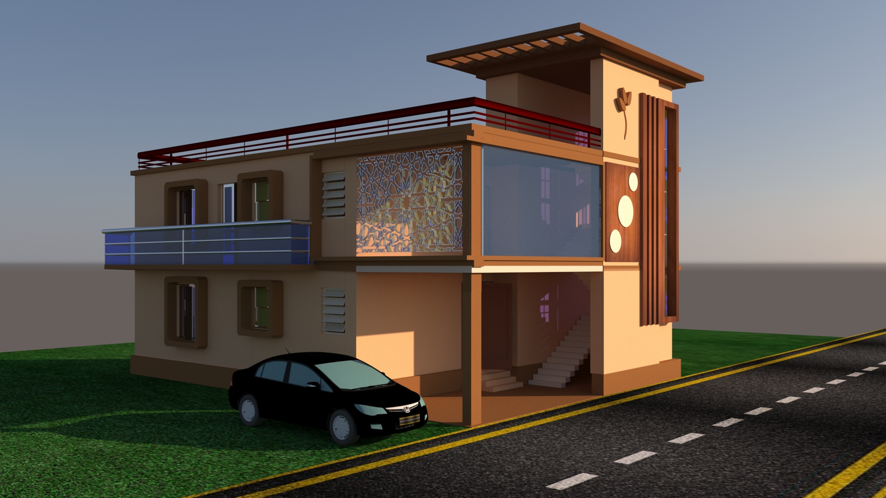
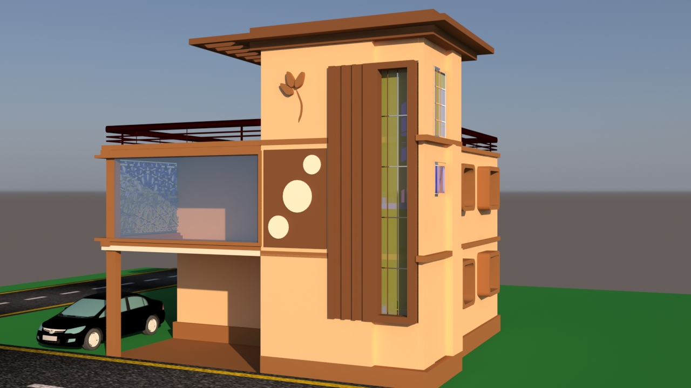
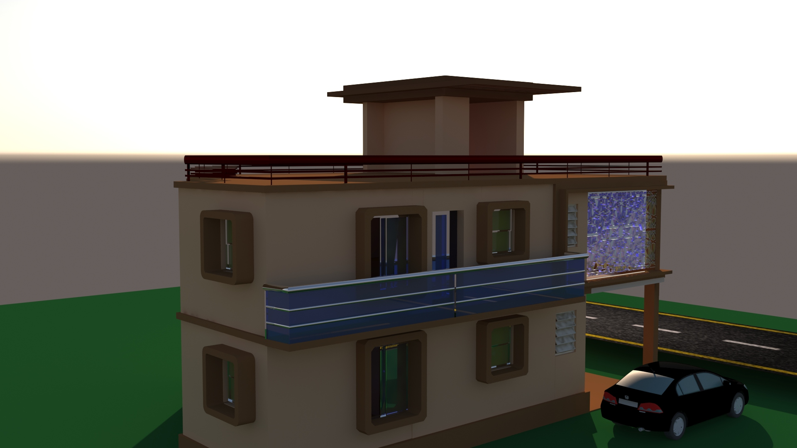

# Modern House 3D Visualization

## Overview

This project is a photorealistic architectural visualization of a modern residential building created during my internship at CTTC Bhubaneswar (July 2025).

The objective was to transform an existing architectural floor plan into a detailed 3D model and create a realistic exterior visualization, including materials, environment setup, lighting, rendering, and animation.

## My Contributions

* Developed the complete 3D model based on a provided architectural layout
* Designed the exterior appearance of the building
* Applied materials and textures for realistic visualization
* Created environmental elements and scene composition
* Configured lighting and rendering settings using V-Ray
* Produced a walkthrough animation using image sequence rendering
* Generated final rendered images and animation output

## Tools & Technologies

* Autodesk 3ds Max 2022
* V-Ray Renderer
* Architectural Visualization Workflow

## Project Features

* Modern residential house visualization
* Realistic exterior materials and textures
* Photorealistic rendering
* Environmental detailing
* Camera walkthrough animation
* High-quality rendered outputs

## Project Preview

  
  

## Files Included

* Walkthrough Animation (MP4)
* Rendered Images
* Texture Assets
* 3ds Max Source File

## Internship Context

This project was completed during my internship at CTTC Bhubaneswar in July 2025. The architectural layout was provided as part of the internship project. My primary responsibility was the 3D modeling, exterior visualization, rendering, and animation development.

## Learning Outcomes

Through this project, I gained practical experience in:

* Architectural visualization
* 3D modeling workflows
* Material and texture application
* Scene composition
* V-Ray rendering
* Animation rendering and post-processing
* Professional visualization project development
